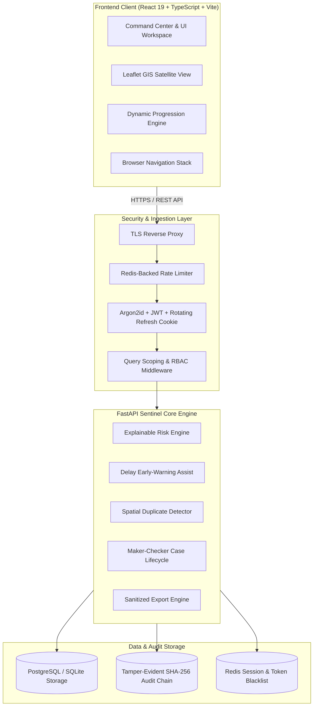
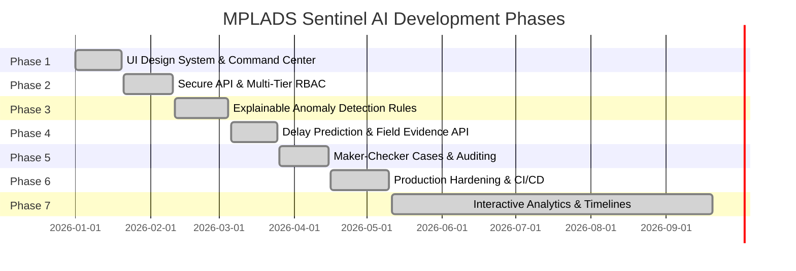
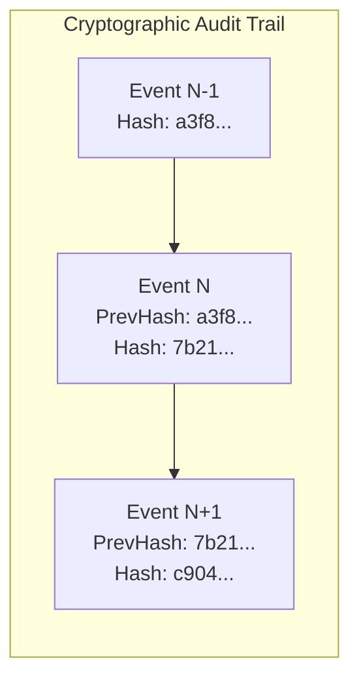

# MPLADS Sentinel AI
### Intelligent, Explainable & Role-Aware Risk Monitoring for National Works Execution

[](https://github.com/SriVishnu230707/mplads-sentinel-ai)
[](https://fastapi.tiangolo.com)
[](https://react.dev)
[](https://leafletjs.com)
[](https://github.com/SriVishnu230707/mplads-sentinel-ai)

MPLADS Sentinel AI is a role-governed risk intelligence platform designed for monitoring the execution, fund utilization, and physical milestones of Member of Parliament Local Area Development Scheme (MPLADS) infrastructure works. It combines explainable anomaly detection, geospatial intelligence, investigation workflows, tamper-evident audit logging, and dynamic temporal analytics.

---

## Table of Contents
1. [System Architecture](#system-architecture)
2. [Phase-Wise Development Roadmap](#phase-wise-development-roadmap)
3. [Key Modules & Platform Capabilities](#key-modules--platform-capabilities)
4. [Role-Based Access Control & Jurisdiction Matrix](#role-based-access-control--jurisdiction-matrix)
5. [Security & Integrity Architecture](#security--integrity-architecture)
6. [API Architecture & Endpoints](#api-architecture--endpoints)
7. [Getting Started & Local Development](#getting-started--local-development)
8. [Demonstration Credentials](#demonstration-credentials)
9. [Automated Verification & Tests](#automated-verification--tests)
10. [Production Deployment Guide](#production-deployment-guide)

---

## System Architecture

The platform uses a decoupled, defense-in-depth architecture where access controls, data boundaries, and risk scoring are enforced strictly at the database query level on the backend.



### Technology Stack

| Layer | Technologies | Key Responsibilities |
|---|---|---|
| **Frontend** | React 19, TypeScript, Vite, Vanilla CSS Design System | High-density dashboard, dark/light theme, timeline player, zero external chart bundle overhead. |
| **Mapping & GIS** | Leaflet 1.9, Esri Satellite Tiles, CartoDB Positron | Satellite overlay, GPS cluster visualization, geofenced inspection radii. |
| **Backend API** | Python 3.11+, FastAPI, Pydantic v2, Uvicorn | Async REST endpoints, declarative validation, OpenAPI schema generation. |
| **Persistence** | SQLAlchemy 2.0 (Async), Alembic, SQLite (Dev), PostgreSQL (Prod) | Relational modeling, migrations, foreign key cascading, query-level scoping. |
| **Security & Cache** | Passlib (Argon2id), PyJWT, Redis, Cryptography | Rotating HTTP-only cookies, tamper-evident hash chaining, brute-force protection. |

---

## Phase-Wise Development Roadmap



### Phase 1: Foundation, Design Tokens & Command Center
- Established an accessible, high-density government monitoring design system with HSL-tailored emerald/teal palettes, high-contrast badges, and full light/dark theme parity.
- Constructed the national Command Center with real-time KPI metrics (Active works, Monitored expenditure, High-risk works, Delayed works).
- Built responsive layout navigation supporting sidebar collapse, quick keyboard shortcuts (`⌘K` / `Ctrl+K` search), and system status monitoring.

### Phase 2: Secure Core API & Multi-Tier Authentication
- Implemented FastAPI REST backend with structured Pydantic v2 schemas and asynchronous SQLAlchemy storage.
- Engineered multi-tier territorial authentication supporting 4 official roles: **Ministry National Supervisor**, **State Nodal Authority**, **District Authority**, and **Auditor / Investigator**.
- Built Argon2id password hashing, short-lived JWT access tokens, and rotating refresh tokens stored in hardened `HttpOnly`, `SameSite=Lax` cookies.
- Developed login throttling, timing-safe authentication handling, and query-level territorial jurisdiction enforcement.

### Phase 3: Explainable Risk Intelligence & Anomaly Rules
- Replaced black-box scoring with explainable multi-factor risk heuristics:
  - **Financial-Physical Divergence Rule**: Flags disbursements significantly exceeding physical milestone certifications (e.g., >80% paid vs <35% executed).
  - **Cost Anomaly Rule**: Benchmarks estimates against comparable projects within the same category and state.
  - **Spatial Duplicate Clustering**: Identifies potential duplicate works within a 2 km geographic proximity using Haversine distance calculations.
  - **Evidence Gap Rule**: Detects works with prolonged milestone delays lacking certified field inspection photos.
- Engineered idempotent alert generation with automatic deduplication, severity grading (Critical, High, Moderate, Low), and audit logging.

### Phase 4: Delay Forecasting & Geofenced Field Evidence
- Integrated an explainable delay early-warning model explicitly designated as non-decisive decision support.
- Built a secure CSV progress import engine: UTF-8 enforcement, 1 MB / 500-row batch limits, dry-run preview mode, and formula-injection sanitization (`=`, `+`, `-`, `@` neutralization).
- Constructed field evidence upload validation checking:
  - Valid coordinates within India geographic boundaries (6°N–38°N, 68°E–98°E).
  - Maximum 2 km allowable distance from official project coordinates.
  - Monotonic timestamp validation preventing post-dated or back-dated photo submissions.

### Phase 5: Investigation Case Management & Maker-Checker Integrity
- Designed full investigation case lifecycle (`TRIAGED` → `INSPECTION_ORDERED` → `SHOW_CAUSE_ISSUED` → `RECOVERY_INITIATED` → `CLOSED`).
- Enforced a strict **Maker-Checker closure rule**: No single officer can both initiate and close an investigation without independent auditor/supervisor sign-off.
- Implemented tamper-evident audit logging using a cryptographic SHA-256 hash chain where each event encapsulates the hash of the preceding record.
- Added scoped CSV export capabilities for national, state, and district portfolios.

### Phase 6: Enterprise Hardening, High-Availability & Deployment
- Implemented Redis-backed distributed rate limiting and token revocation blacklist.
- Configured asynchronous Alembic database migrations.
- Established Docker Compose container isolation with non-root runtime users and private bridge networks.
- Built fail-closed production controls (`AUTO_SEED=false`, high-entropy secret enforcement, independent database and Redis verification).
- Automated a 28-point integration test suite verifying authentication, RBAC boundaries, alert lifecycles, and cryptographic chain integrity.

### Phase 7: Interactive Progression Analytics & Command Center Enhancements
- **Dynamic Progression Timeline**: Added interactive 6-month historical timeline controls (`Apr` → `Sep`) with automated **▶ Play / ⏸ Pause** playback and month scrubber.
- **State & District Progress Graphs**:
  - Horizontal dual-track state execution comparison (physical milestone progress vs. financial absorption marker).
  - Interactive drilldown into district-level SVG column charts comparing physical vs. financial utilization per district.
  - Dynamic Month-over-Month (MoM) milestone velocity tracking badges (e.g. `+6% MoM`).
- **Interactive Trend Chart**: Real-time cursor crosshair, time horizon selector (`30D`, `90D`, `6M`), series toggling, and floating statistics tooltip.
- **Unified Clickable Map Preview**: Instant click-to-expand behavior from the Command Center satellite preview card into full Map Intelligence (`#map`).
- **Browser History Stack**: Full forward/backward history navigation with `Alt + ←` and `Alt + →` keyboard shortcuts.

---

## Key Modules & Platform Capabilities

| Module | Route / Page | Capabilities |
|---|---|---|
| **Command Centre** | `#overview` | Live national metrics, 6-month risk trend line, interactive state/district progression timeline player, clickable satellite distribution map, live audit activity feed. |
| **Risk Alerts** | `#alerts` | Filterable alert register categorized by risk severity, rule trigger explanation, audit actions, and one-click case creation. |
| **Works & Projects** | `#projects` | Full portfolio explorer with multi-parameter search, financial absorption metrics, physical execution bars, and detailed project drawer. |
| **Map Intelligence** | `#map` | Interactive full-screen Leaflet satellite and road GIS map with GPS risk markers, district clustering, and satellite layer toggling. |
| **Investigations** | `#cases` | Investigation case management with evidence dossiers, chronological event logs, and maker-checker approval workflows. |
| **Reports** | `#reports` | Decision-ready portfolio summaries, compliance digests, and CSV exports sanitized against spreadsheet formula injection. |
| **Administration** | `#admin` | Role governance, rule version management, system health diagnostic monitors, and cryptographic audit hash chain integrity verification. |
| **Profile** | `#profile` | Official identity credentials, assigned territorial jurisdiction, and active session security tokens. |

---

## Role-Based Access Control & Jurisdiction Matrix

Data boundaries are enforced at the database query level on every request. Client-side visibility is never relied upon as an access control mechanism.

| Feature / Data Scope | Ministry National Supervisor | State Nodal Authority | District Authority | Auditor / Investigator |
|---|---|---|---|---|
| **Territorial Scope** | All States & UTs | Assigned State only (e.g. KA) | Assigned District only (e.g. Bengaluru Rural) | All States & UTs |
| **Command Center Metrics** | National Aggregates | State-Level Aggregates | District-Level Aggregates | National Aggregates |
| **Risk Scans** | Full Portfolio | State Works | District Works | Full Portfolio |
| **Alert Triage** | Read & Assign | Read & Assign | Read & Provide Evidence | Read & Audit |
| **Case Initiation** | Allowed | Allowed | Restricted | Allowed |
| **Case Closure** | Maker-Checker Approval | State Sign-Off | Restricted | Independent Reviewer Sign-Off |
| **CSV Data Export** | Full National Data | State Scope Only | District Scope Only | Full National Audit |
| **Audit Hash Integrity** | Verify Chain | Restricted | Restricted | Verify Chain |

---

## Security & Integrity Architecture



1. **Tamper-Evident Hash Chain**: Each audit event stores the SHA-256 hash of its payload concatenated with the cryptographic hash of the preceding record (`prev_hash`). Any modification or deletion invalidates the chain.
2. **Strict Sanitization**: CSV export fields starting with spreadsheet execution triggers (`=`, `+`, `-`, `@`) are prefixed with single-quote delimiters to eliminate CSV formula injection risks.
3. **Session Security**: JWT access tokens have a short 15-minute lifespan. Session continuity relies on rotating refresh tokens stored in secure, `HttpOnly`, `SameSite=Lax` cookies.
4. **Geofencing & Monotonicity**: Evidence uploads are validated against project GPS coordinates (maximum allowable offset of 2 km) and historical timestamp monotonicity to prevent fabricated inspection records.

---

## API Architecture & Endpoints

The API is fully documented through OpenAPI/Swagger at `/docs`. Key endpoints include:

### Authentication & Sessions
- `POST /api/v1/auth/login` - Authenticates official credentials and sets the rotating refresh cookie.
- `POST /api/v1/auth/refresh` - Issues a new short-lived access token using the HTTP-only refresh cookie.
- `POST /api/v1/auth/logout` - Revokes refresh session and blacklists the active token.
- `GET /api/v1/auth/me` - Returns active officer profile, jurisdiction, and roles.

### Portfolio & Operations
- `GET /api/v1/dashboard/summary` - Aggregates scoped portfolio metrics (works, delay counts, expenditures).
- `GET /api/v1/projects` - Scoped project register with search and filter parameters.
- `GET /api/v1/projects/{id}` - Comprehensive project intelligence file with financial milestones and GPS coordinates.
- `POST /api/v1/projects/import` - Secure CSV progress batch upload (supports dry-run validation).

### Risk Intelligence & Audits
- `POST /api/v1/scan` - Executes explainable anomaly detection engine over the authorized scope.
- `GET /api/v1/alerts` - Retrieves prioritized risk alerts.
- `POST /api/v1/alerts/{id}/triage` - Updates alert status (Under Review, Escalated, Suppressed).
- `POST /api/v1/cases` - Creates an investigation case dossier.
- `POST /api/v1/cases/{id}/close` - Maker-checker closure requiring dual independent sign-off.
- `GET /api/v1/audit/integrity` - Validates the SHA-256 cryptographic audit hash chain.

---

## Getting Started & Local Development

### Prerequisites
- **Node.js**: v18.0.0 or higher
- **Python**: v3.11 or higher
- **Git**

### Step 1: Clone Repository
```powershell
git clone https://github.com/SriVishnu230707/mplads-sentinel-ai.git
cd mplads-sentinel-ai
```

### Step 2: Install and Start Frontend
```powershell
npm install
npm run dev
```
The frontend dev server runs at `http://localhost:5173`.

### Step 3: Setup and Start Backend API
Open a second terminal in the project root:
```powershell
cd backend
py -m venv .venv
.\.venv\Scripts\python.exe -m pip install -r requirements.txt
cd ..
npm run dev:api
```
The FastAPI backend runs at `http://localhost:8000` with Swagger docs at `http://localhost:8000/docs`.

---

## Demonstration Credentials

All seeded demonstration accounts use the password: `Sentinel@2026`

| Role | Official Email | Assigned Territorial Scope |
|---|---|---|
| **Ministry National Supervisor** | `ministry@sentinel.gov.in` | National (All States & Districts) |
| **State Nodal Authority** | `state@sentinel.gov.in` | Karnataka state portfolio only |
| **District Authority** | `district@sentinel.gov.in` | Bengaluru Rural district works only |
| **Auditor / Investigator** | `auditor@sentinel.gov.in` | Independent audit scope across all works |

> [!WARNING]
> These credentials and seeds are synthetic development artifacts. In production environments, `AUTO_SEED=false` must be set and real institutional accounts provisioned.

---

## Automated Verification & Tests

Run the complete verification pipeline:

```powershell
# Verify TypeScript build
npm run build

# Run comprehensive API security and unit test suite
npm run test:api
```

### Test Coverage Highlights
- **28 Automated Backend Tests** verifying:
  - Argon2id password authentication and timing-attack resistance.
  - JWT token lifecycle and refresh cookie rotation.
  - Multi-tier jurisdiction enforcement across Ministry, State, and District scopes.
  - Rule-based risk score calculations and idempotent alert creation.
  - Cryptographic audit chain tamper detection.
  - CSV progress import limits, dry-run safety, and formula-injection neutralization.
  - Maker-checker case closure state machines.

---

## Production Deployment Guide

1. **Environment Configuration**: Copy `deployment.env.example` to `.env` in your deployment environment and configure high-entropy secrets.
2. **Containerized Execution**:
   ```bash
   docker-compose -f docker-compose.prod.yml up -d --build
   ```
3. **Health & Liveness Probes**:
   - `GET /health` - Liveness probe verifying process responsiveness.
   - `GET /ready` - Readiness probe validating active PostgreSQL and Redis connections.
   - `GET /api/v1/audit/integrity` - Authenticated probe verifying cryptographic audit hash continuity.
4. **Security Best Practices**:
   - Run API behind a hardened TLS reverse proxy (Nginx or Caddy).
   - Ensure PostgreSQL, Redis, and storage buckets are bound to internal networks without public port exposure.
   - Configure external log forwarding for the tamper-evident audit hash log.

---

## License & Compliance

MPLADS Sentinel AI is released for public service technology evaluation and development under standard institutional guidelines. All government data structures follow Ministry of Statistics and Programme Implementation (MoSPI) MPLADS guidelines.
