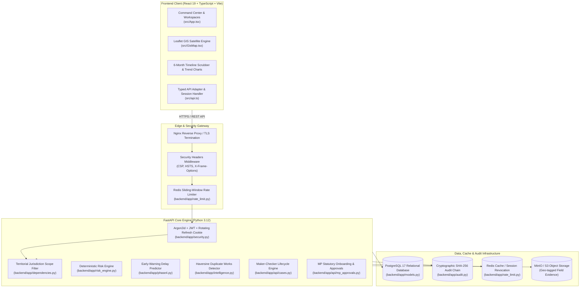
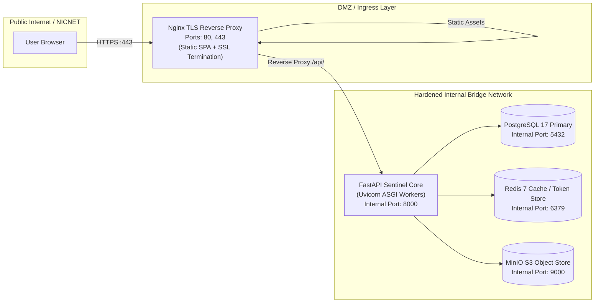

# MPLADS Sentinel AI
### Intelligent, Explainable & Role-Aware Vigilance Platform for National Works Execution

[](https://fastapi.tiangolo.com)
[](https://react.dev)
[](https://leafletjs.com)
[](https://github.com/SriVishnu230707/mplads-sentinel-ai)
[](https://www.postgresql.org)
[](https://www.docker.com)

**MPLADS Sentinel AI** is an institutional-grade, role-governed vigilance and risk-intelligence platform designed to monitor the execution, fund utilization, and physical milestones of **Member of Parliament Local Area Development Scheme (MPLADS)** infrastructure projects across India.

Under the statutory guidelines issued by the Ministry of Statistics and Programme Implementation (MoSPI), each Member of Parliament (MP) recommends developmental public works with an annual entitlement of ₹5 Crore. MPLADS Sentinel AI eliminates blind spots, financial mismatches, duplicate works, and unverified milestones through **deterministic explainable anomaly detection**, **strict query-level territorial data isolation**, **maker-checker case governance**, **cryptographic audit trails**, and **geospatial intelligence**.

---

## Table of Contents
1. [System Architecture](#system-architecture)
2. [How Each Platform Module Works](#how-each-platform-module-works)
   - [Command Centre & Dynamic Timeline Engine](#1-command-centre--dynamic-timeline-engine-overview)
   - [Risk Alerts & Idempotent Anomaly Scanner](#2-risk-alerts--idempotent-anomaly-scanner-alerts)
   - [Works & Projects Portfolio Explorer](#3-works--projects-portfolio-explorer-projects)
   - [Map Intelligence & Satellite GIS](#4-map-intelligence--satellite-gis-map)
   - [Investigation Case Management & Maker-Checker Workflows](#5-investigation-case-management--maker-checker-workflows-cases)
   - [Decision-Ready Reports & Sanitized Exports](#6-decision-ready-reports--sanitized-exports-reports)
   - [MP Statutory Onboarding & Ministry Approval System](#7-mp-statutory-onboarding--ministry-approval-system-mp_approvals)
   - [Administration, Audit Ledger & System Diagnostics](#8-administration-audit-ledger--system-diagnostics-admin)
   - [Profile & Security Identity](#9-profile--security-identity-profile)
3. [Core Engines & Algorithmic Formulations](#core-engines--algorithmic-formulations)
   - [Explainable Risk Scoring Heuristics](#a-explainable-risk-scoring-heuristics)
   - [Spatial Duplicate Detection & Haversine Distance](#b-spatial-duplicate-detection--haversine-distance)
   - [Delay Early-Warning Assist](#c-delay-early-warning-assist)
   - [Cryptographic SHA-256 Audit Trail](#d-cryptographic-sha-256-audit-trail)
4. [Security, Governance & Multi-Tier RBAC](#security-governance--multi-tier-rbac)
   - [Territorial Jurisdiction Boundaries](#territorial-jurisdiction-boundaries)
   - [Authentication & Session Lifecycle](#authentication--session-lifecycle)
   - [Field Evidence Anti-Tamper Controls](#field-evidence-anti-tamper-controls)
   - [Spreadsheet Formula Injection Neutralization](#spreadsheet-formula-injection-neutralization)
5. [Hosting, Server Infrastructure & Deployment](#hosting-server-infrastructure--deployment)
   - [Server Hosting Architecture (Backend)](#a-server-hosting-architecture-backend)
   - [Frontend Hosting Architecture (Client)](#b-frontend-hosting-architecture-client)
   - [Containerized Multi-Service Orchestration](#c-containerized-multi-service-orchestration)
   - [Production Nginx Reverse Proxy Configuration](#d-production-nginx-reverse-proxy-configuration)
   - [High Availability, Health Probes & Monitoring](#e-high-availability-health-probes--monitoring)
6. [API Architecture & Endpoints](#api-architecture--endpoints)
7. [Local Development Setup](#local-development-setup)
8. [Demonstration Credentials Matrix](#demonstration-credentials-matrix)
9. [Automated Verification & Test Pipeline](#automated-verification--test-pipeline)

---

## System Architecture

The platform uses a defense-in-depth, decoupled client-server architecture where security policies, data boundaries, and risk scoring are enforced strictly on the backend at the database query level.


```mermaid
flowchart TB
    subgraph ClientLayer["Frontend Client (React 19 + TypeScript + Vite)"]
        UI["Command Center & Workspaces\n(src/App.tsx)"]
        GIS["Leaflet GIS Satellite Engine\n(src/GisMap.tsx)"]
        Timeline["6-Month Timeline Scrubber & Trend Charts"]
        APIClient["Typed API Adapter & Session Handler\n(src/api.ts)"]
    end

    subgraph ReverseProxyLayer["Edge & Security Gateway"]
        Nginx["Nginx Reverse Proxy / TLS Termination"]
        SecHeaders["Security Headers Middleware\n(CSP, HSTS, X-Frame-Options)"]
        RateLimiter["Redis Sliding-Window Rate Limiter\n(backend/app/rate_limit.py)"]
    end

    subgraph ApplicationLayer["FastAPI Core Engine (Python 3.12)"]
        AuthModule["Argon2id + JWT + Rotating Refresh Cookie\n(backend/app/security.py)"]
        RBAC["Territorial Jurisdiction Scope Filter\n(backend/app/dependencies.py)"]
        RiskEngine["Deterministic Risk Engine\n(backend/app/risk_engine.py)"]
        DelayPredictor["Early-Warning Delay Predictor\n(backend/app/phase4.py)"]
        SpatialClustering["Haversine Duplicate Works Detector\n(backend/app/intelligence.py)"]
        CaseEngine["Maker-Checker Lifecycle Engine\n(backend/app/api/cases.py)"]
        MPDossier["MP Statutory Onboarding & Approvals\n(backend/app/api/mp_approvals.py)"]
    end

    subgraph StorageLayer["Data, Cache & Audit Infrastructure"]
        Postgres[("PostgreSQL 17 Relational Database\n(backend/app/models.py)")]
        AuditChain[("Cryptographic SHA-256 Audit Chain\n(backend/app/audit.py)")]
        RedisSession[("Redis Cache / Session Revocation\n(backend/app/rate_limit.py)")]
        MinIO[("MinIO / S3 Object Storage\n(Geo-tagged Field Evidence)")]
    end

    ClientLayer -->|HTTPS / REST API| Nginx
    Nginx --> SecHeaders
    SecHeaders --> RateLimiter
    RateLimiter --> AuthModule
    AuthModule --> RBAC
    RBAC --> ApplicationLayer
    ApplicationLayer --> Postgres
    ApplicationLayer --> AuditChain
    ApplicationLayer --> RedisSession
    ApplicationLayer --> MinIO
```

### Technology Matrix

| Layer | Component | Technologies | Purpose |
|---|---|---|---|
| **Frontend UI** | Application Core | React 19, TypeScript, Vite | High-density administrative workspace, zero external chart runtime overhead. |
| **GIS Mapping** | Geospatial Engine | Leaflet 1.9, Esri Satellite, CartoDB | Satellite imagery, GPS risk-clustering, geofenced inspection radii. |
| **Design System** | Custom Vanilla CSS | CSS Custom Properties, HSL tokens | High-contrast government design system, dark/light theme parity. |
| **Backend API** | REST Gateway | FastAPI, Pydantic v2, Python 3.12, Uvicorn | High-throughput asynchronous endpoints, declarative schema validation. |
| **Data Persistence**| Relational DB | SQLAlchemy 2.0, Alembic, PostgreSQL / SQLite | ACID transactions, foreign key cascading, query-level jurisdiction scoping. |
| **Cache & State** | Distributed Cache | Redis 7 | Sliding-window rate limiting, token blacklist, session revocation. |
| **Integrity & Cryptography**| Hash Ledger | Python `hashlib` (SHA-256), `passlib` (Argon2id) | Tamper-evident blockchain-like audit trail, high-entropy password hashing. |

---

## How Each Platform Module Works

MPLADS Sentinel AI provides nine functional modules designed for distinct administrative and vigilance workflows:

### 1. Command Centre & Dynamic Timeline Engine (`#overview`)
The Command Centre serves as the primary situational awareness cockpit:
- **Territory-Scoped KPI Metrics**: Displays real-time aggregations of *Active Works*, *Monitored Outlay*, *High-Risk Works*, and *Delayed Works*, automatically scoped to the logged-in officer's jurisdiction.
- **Dynamic 6-Month Timeline Scrubber**: Allows operators to navigate historical execution states (`Apr` $\rightarrow$ `Sep`) either manually with a month scrubber or automatically with the interactive **▶ Play / ⏸ Pause** engine.
- **Dual-Track Comparative Progression Graphs**:
  - Horizontal state bars juxtaposing physical execution milestones against financial fund absorption.
  - Interactive drilldown into district-level SVG column charts comparing physical delivery vs financial outlay.
  - Month-over-Month (MoM) milestone velocity tracking badges (e.g., `+6% MoM`).
- **Interactive Multi-Horizon Risk Trend**: Real-time cursor crosshair, horizon selector (`30D`, `90D`, `6M`), and floating statistical tooltips.
- **Clickable Satellite Preview Card**: Embedded mini-map showing active regional coordinates that clicks directly into the full GIS Intelligence suite.
- **Live Security Audit Feed**: Shows real-time chronological security events directly from the cryptographic ledger.

### 2. Risk Alerts & Idempotent Anomaly Scanner (`#alerts`)
The alerts registry surfaces prioritized anomalies requiring human vigilance:
- **Idempotent Scan Trigger**: A single-click "Run Anomaly Scan" executes the explainable risk engine across all projects in the officer's jurisdiction. Duplicate alerts for existing active conditions are automatically prevented via unique database constraints (`uq_active_rule_alert`).
- **Explainable Findings**: Alerts display the exact rule trigger code (e.g., `FIN_PHYSICAL_MISMATCH`), confidence percentage (82%–99%), human-readable rationale, and recommended corrective actions.
- **Triage Action Modal**: Officers can transition alerts into `Under Review`, `Escalated`, or `Suppressed` states with mandatory audit justification notes.
- **One-Click Case Escalation**: Critical alerts can be escalated directly into formal maker-checker investigation cases with pre-populated evidence dossiers.

### 3. Works & Projects Portfolio Explorer (`#projects`)
A comprehensive directory of all approved MPLADS works within the user's jurisdiction:
- **Multi-Parameter Search & Filters**: Search by work title, work ID, location, or implementing agency, and filter by risk severity, operational status, and category (Water, Sanitation, Education, Roads, Energy).
- **Interactive Project Drawer / Dossier**: Selecting any project opens a deep-dive drawer containing:
  - Financial absorption progress bar vs reported physical progress bar.
  - Benchmark comparison against the peer category median cost in the same state.
  - **Compliance Checklist**: Evaluates milestone timeliness, evidence staleness, expenditure limits, and payment alignment.
  - **Early-Warning Delay Forecast**: Explains specific delay factors and projected completion probabilities.
  - **Spatial Duplicate Analysis**: Surfaces proximate projects sharing high text, cost, and location similarity.
  - **Field Inspection History**: Displays historical geo-tagged inspection records and evidence photos.
  - **CSV Batch Progress Import**: Allows District Authorities to upload batch updates in CSV format with dry-run validation.

### 4. Map Intelligence & Satellite GIS (`#map`)
A full-screen interactive GIS interface for geospatial vigilance:
- **Dual Base Tile Layers**: Toggles between high-resolution **Esri World Imagery** satellite tiles and clean **CartoDB Positron** road maps.
- **Risk-Coded Cluster Markers**: Projects are rendered at precise GPS coordinates with color-coded circular badges:
  - 🔴 **Critical Risk** (Score 80–100)
  - 🟠 **High Risk** (Score 60–79)
  - 🔵 **Moderate Risk** (Score 35–59)
  - 🟢 **Low Risk / Healthy** (Score 0–34)
- **Automatic Spatial Centering**: Quick-filter state pills automatically re-center and zoom the Leaflet camera to designated state coordinates.
- **Interactive Project Popup Cards**: Clicking any map pin reveals project financial details, risk badges, and a direct "View Deep Dossier" button.

### 5. Investigation Case Management & Maker-Checker Workflows (`#cases`)
Ensures procedural integrity for suspected irregularities:
- **Four-Stage Case Lifecycle**:
  $$\text{OPEN} \longrightarrow \text{INVESTIGATING} \longrightarrow \text{CLOSURE\_REVIEW} \longrightarrow \text{CLOSED}$$
- **Strict Maker-Checker Closure Governance**: The backend strictly prohibits an officer who initiated or investigated a case from unilaterally closing it (`created_by != current_user.id`). Closure requires dual sign-off from an independent auditor or supervisor.
- **Evidence Dossier Logging**: Chronological case notes, inspection reports, and formal show-cause notices are permanently attached to the case record.
- **Audit-Logged State Transitions**: Every state transition generates a digitally signed entry in the SHA-256 audit ledger.

### 6. Decision-Ready Reports & Sanitized Exports (`#reports`)
Eliminates manual reporting overhead while protecting against export vulnerabilities:
- **Pre-Compiled Portfolio Digests**: Real-time generation of executive summaries, high-risk works registers, and expenditure compliance sheets.
- **One-Click Print / PDF Format**: Formats reports into clean, printable government digests with official classification stamps.
- **Formula-Injection Sanitized CSV Exports**: All export routines neutralize spreadsheet formula injection vulnerabilities (`=`, `+`, `-`, `@`) before generating the downloadable CSV payload.

### 7. MP Statutory Onboarding & Ministry Approval System (`#mp_approvals`)
A dedicated end-to-end statutory credentialing module for Members of Parliament:
- **Public Onboarding Application**: Candidates or authorized representatives apply via a secure modal, submitting comprehensive statutory documentation:
  - Personal Information: Full name, DOB, phone, permanent/present addresses, spouse/parent name.
  - Parliamentary Mandate: House (Lok Sabha / Rajya Sabha), State, Parliamentary Constituency, Political Party, Term Label.
  - Statutory Verification Documents: Election Commission of India (ECI) Winning Certificate Number, Date of Declaration, Returning Officer Code, Voter ID, Electoral Roll Serial, Driving License, Community Certificate, Birth Certificate, PAN, and Aadhaar.
  - Asset & Liability Declarations: Detailed immovable properties, movable assets, and ECI affidavit references.
  - PFMS & Banking Credentials: Bank name, account number, IFSC code, and Public Financial Management System (PFMS) agency code for official fund disbursement.
- **Status Tracking Modal**: Allows applicants to track their application status (`PENDING`, `APPROVED`, `REJECTED`) in real-time using their application ID or official email.
- **Ministry Review Cockpit (`#mp_approvals`)**: Accessible exclusively to Ministry National Supervisors:
  - Displays pending, approved, and rejected application queues.
  - Full statutory dossier viewer displaying all submitted certificates, asset breakdowns, and banking data.
  - Single-click approval that atomically:
    1. Creates a dedicated Parliamentary Constituency `Organization`.
    2. Provisions an active `User` account with the `mp` role.
    3. Hashes the password with Argon2id and commits the credentials.
    4. Appends a tamper-evident audit record to the ledger.
  - Rejection workflow requiring formal justification notes visible to the applicant.

### 8. Administration, Audit Ledger & System Diagnostics (`#admin`)
Platform governance, integrity verification, and diagnostic observability:
- **Cryptographic Audit Chain Verification**: Executes an end-to-end mathematical verification of the SHA-256 audit ledger, proving zero tampering, reordering, or deletion of log entries.
- **Official Access Roster**: Displays active administrative personnel, roles, and assigned territorial jurisdictions.
- **Rule Engine Version Management**: Displays active vigilance heuristic versions, trigger thresholds, and scoring weights.
- **Diagnostic System Monitors**: Live status cards for API responsiveness, database connectivity, and Redis cache health.

### 9. Profile & Security Identity (`#profile`)
Official officer credentials and active session inspection:
- Displays assigned official identity, role designation, and administrative organization.
- Details the precise territorial jurisdiction scope enforced on the officer's queries.
- Displays statutory credentials (masked PAN, Aadhaar, PFMS code) and active session JWT token expiration times.

---

## Core Engines & Algorithmic Formulations

### A. Explainable Risk Scoring Heuristics
Located in [`backend/app/risk_engine.py`](file:///c:/projects/mplads-sentinel-ui/backend/app/risk_engine.py), the scoring engine evaluates projects deterministically. Every point added to the composite score is tied to an explicit finding:

```python
def evaluate(project: Project, now: datetime | None = None) -> tuple[int, RiskLevel, list[dict]]:
    ...
```

1. **Financial-Physical Divergence Rule (`FIN_PHYSICAL_MISMATCH`)**:
   Triggered when financial disbursement substantially outpaces certified physical execution:
   $$\Delta = \text{FinancialProgress}\% - \text{PhysicalProgress}\%$$
   $$\text{Condition: } \Delta \ge 25\% \quad \text{and} \quad \text{FinancialProgress} \ge 50\%$$
   $$\text{Points: } \min(38, 18 + \lfloor \Delta / 3 \rfloor), \quad \text{Confidence: } 94\%$$

2. **Cost Benchmark Outlier Rule (`COST_BENCHMARK_OUTLIER`)**:
   Compares sanctioned project cost against the median cost of similar works within the same category and state:
   $$\text{Deviation} = \frac{\text{SanctionedLakh} - \text{PeerMedianLakh}}{\text{PeerMedianLakh}} \times 100$$
   $$\text{Condition: } \text{Deviation} \ge 25\%$$
   $$\text{Points: } \min(27, 12 + \lfloor \text{Deviation} / 5 \rfloor), \quad \text{Confidence: } 82\%$$

3. **Stale Field Evidence Rule (`STALE_FIELD_EVIDENCE`)**:
   Detects active ongoing works lacking recent physical ground inspection:
   $$\text{StaleDays} = \text{CurrentDate} - \text{LastEvidenceDate}$$
   $$\text{Condition: } \text{StaleDays} \ge 45 \quad \text{and} \quad \text{Status} == \text{"in\_progress"}$$
   $$\text{Points: } \min(20, 8 + \lfloor \text{StaleDays} / 30 \rfloor), \quad \text{Confidence: } 88\%$$

4. **Completion Deadline Overdue Rule (`COMPLETION_OVERDUE`)**:
   Identifies works exceeding their approved target completion date:
   $$\text{OverdueDays} = \text{CurrentDate} - \text{PlannedCompletionDate}$$
   $$\text{Condition: } \text{OverdueDays} > 0 \quad \text{and} \quad \text{PhysicalProgress} < 100\%$$
   $$\text{Points: } \min(25, 10 + \lfloor \text{OverdueDays} / 30 \rfloor), \quad \text{Confidence: } 99\%$$

**Total Score & Categorization**:
$$\text{Score} = \min\left(100, \sum \text{FindingPoints}\right)$$
$$\text{RiskLevel} = \begin{cases} 
\text{CRITICAL} & \text{if Score} \ge 80 \\
\text{HIGH} & \text{if } 60 \le \text{Score} < 80 \\
\text{MODERATE} & \text{if } 35 \le \text{Score} < 60 \\
\text{LOW} & \text{if Score} < 35 
\end{cases}$$

---

### B. Spatial Duplicate Detection & Haversine Distance
Located in [`backend/app/intelligence.py`](file:///c:/projects/mplads-sentinel-ui/backend/app/intelligence.py#L42-L66) and [`backend/app/phase4.py`](file:///c:/projects/mplads-sentinel-ui/backend/app/phase4.py#L9-L15), this engine detects potential double-billing or duplicate works recommended at identical locations.

1. **Haversine Distance**:
   Calculates great-circle distance between two geographic coordinates:
   $$d = 2R \arcsin\left(\sqrt{\sin^2\left(\frac{\Delta \phi}{2}\right) + \cos(\phi_1)\cos(\phi_2)\sin^2\left(\frac{\Delta \lambda}{2}\right)}\right)$$
   Where $R = 6371\text{ km}$, $\phi$ is latitude, and $\lambda$ is longitude.

2. **Composite Similarity Score**:
   $$\text{Score} = \text{round}\left(100 \times \left(0.55 \cdot S_{\text{title}} + 0.20 \cdot S_{\text{cost}} + 0.25 \cdot S_{\text{location}}\right)\right)$$
   - **Title Similarity ($S_{\text{title}}$)**: Ratcliff-Obershelp sequence pattern matching ratio on casefolded titles.
   - **Cost Similarity ($S_{\text{cost}}$)**:
     $$S_{\text{cost}} = 1 - \min\left(1, \frac{|\text{Cost}_A - \text{Cost}_B|}{\max(\text{Cost}_A, \text{Cost}_B, 1)}\right)$$
   - **Location Proximity ($S_{\text{location}}$)**:
     $$S_{\text{location}} = \max\left(0, 1 - \frac{d_{\text{km}}}{10}\right)$$
   - **Vendor Match Bonus**: $+8$ points if implementing vendors match.
   - Pairs scoring $\ge 60$ are surfaced as duplicate candidates.

---

### C. Delay Early-Warning Assist
Located in [`backend/app/phase4.py`](file:///c:/projects/mplads-sentinel-ui/backend/app/phase4.py#L17-L46), this non-decisive advisory model generates early warnings before projects become formally delinquent:
- Analyzes remaining days to completion vs reported physical velocity.
- Evaluates disbursement gaps and evidence staleness.
- Outputs a transparent delay probability (0%–95%), confidence tier (`High`, `Medium`, `Low`), and specific causative factors.

---

### D. Cryptographic SHA-256 Audit Trail
Located in [`backend/app/audit.py`](file:///c:/projects/mplads-sentinel-ui/backend/app/audit.py), the platform implements an immutable, tamper-evident hash chain. Every security-relevant event $E_n$ is cryptographically linked to the preceding event $E_{n-1}$:

$$H_0 = \text{"0"}^{64} \quad (\text{Genesis Hash})$$
$$H_n = \text{SHA256}\left(\text{JSON}_{\text{canonical}}\left(\{ \text{action}, \text{actor\_id}, \text{details}, \text{entity\_id}, \text{entity\_type}, \text{occurred\_at}, \text{outcome}, \text{previous\_hash} = H_{n-1} \}\right)\right)$$

The verification routine `verify_chain(db)` iterates through the ledger sequentially. If any record's timestamp, details, outcome, or order is modified, the hash chain breaks immediately, producing a validation failure alert in the administrative dashboard.

---

## Security, Governance & Multi-Tier RBAC

### Territorial Jurisdiction Boundaries
Data boundaries are enforced strictly at the database query level on the backend ([`backend/app/dependencies.py`](file:///c:/projects/mplads-sentinel-ui/backend/app/dependencies.py#L40-L57)). Client-side filtering is never relied upon for security:

```python
def apply_project_scope(query, user: User):
    org = user.organization
    if user.role in {Role.MINISTRY, Role.AUDITOR} and org.level.value == "national":
        return query
    if user.role == Role.MP:
        if org.constituency:
            return query.where(Project.constituency == org.constituency)
        if org.district:
            return query.where(Project.state == org.state, Project.district == org.district)
        if org.state:
            return query.where(Project.state == org.state)
    if org.level.value == "state":
        return query.where(Project.state == org.state)
    if org.level.value == "district":
        return query.where(Project.state == org.state, Project.district == org.district)
    return query.where(Project.id == "__no_access__")
```

| Official Role | Jurisdiction Scope | Query-Level SQL Boundary | Case Initiation | Case Closure |
|---|---|---|---|---|
| **Ministry National Supervisor** | National (All States & UTs) | Unrestricted | All Works | Maker-Checker Approval |
| **State Nodal Authority** | Assigned State Only | `WHERE state = :user_state` | State Works | State Sign-Off |
| **District Authority** | Assigned District Only | `WHERE state = :user_state AND district = :user_district` | Restricted | Restricted |
| **Member of Parliament** | Assigned Parliamentary Constituency | `WHERE constituency = :user_constituency` | Constituency Works | Restricted |
| **Auditor / Investigator** | National (Independent Vigilance) | Unrestricted (Audit Mode) | All Works | Independent Reviewer Sign-Off |

---

### Authentication & Session Lifecycle
- **Password Security**: Passwords are hashed using the memory-hard **Argon2id** algorithm (`passlib.hash.argon2`). Timing-safe equality checks prevent enumeration attacks.
- **Short-Lived Access Tokens**: Signed JWT access tokens with a 15-minute expiration time carry the user ID, role, and a numeric `token_version`.
- **Rotating Refresh Tokens**: High-entropy 32-byte tokens stored in hardened `HttpOnly`, `SameSite=Lax`, `Secure` cookies. Token rotation on every refresh invalidates stolen tokens.
- **Instant Session Revocation**: Increasing `token_version` on the user record immediately invalidates all active access tokens across all devices.

---

### Field Evidence Anti-Tamper Controls
Located in [`backend/app/api/projects.py`](file:///c:/projects/mplads-sentinel-ui/backend/app/api/projects.py), field evidence submissions must satisfy strict physical validity tests:
1. **India Bounding Box Validation**: Coordinates must lie within $6^\circ\text{N} \le \text{Lat} \le 38^\circ\text{N}$ and $68^\circ\text{E} \le \text{Lng} \le 98^\circ\text{E}$.
2. **2 km Geofencing Radius**: The Haversine distance between evidence capture GPS coordinates and official project coordinates must not exceed 2.0 km.
3. **Monotonic Timestamp Ordering**: Submitted timestamps cannot be future-dated and cannot precede existing approved milestones for the same project.

---

### Spreadsheet Formula Injection Neutralization
Exported CSV files are safeguarded against CSV Injection (Formula Injection). Any field beginning with spreadsheet formula triggers (`=`, `+`, `-`, `@`) is automatically escaped with a prepended single-quote (`'`):
```python
def sanitize_cell(value: object) -> str:
    cell_str = str(value if value is not None else "")
    if cell_str.startswith(("=", "+", "-", "@")):
        return f"'{cell_str}"
    return cell_str
```

---

## Hosting, Server Infrastructure & Deployment

The platform is designed for enterprise high-availability hosting across on-premise government datacenters (e.g., National Informatics Centre / MeghRaj cloud) or containerized cloud infrastructure.


```mermaid
flowchart LR
    subgraph PublicInternet["Public Internet / NICNET"]
        Browser["User Browser"]
    end

    subgraph DMZ["DMZ / Ingress Layer"]
        NginxProxy["Nginx TLS Reverse Proxy\nPorts: 80, 443\n(Static SPA + SSL Termination)"]
    end

    subgraph InternalNetwork["Hardened Internal Bridge Network"]
        direction TB
        FastAPIApp["FastAPI Sentinel Core\n(Uvicorn ASGI Workers)\nInternal Port: 8000"]
        PostgresDB[("PostgreSQL 17 Primary\nInternal Port: 5432")]
        RedisCache[("Redis 7 Cache / Token Store\nInternal Port: 6379")]
        MinIOStorage[("MinIO S3 Object Store\nInternal Port: 9000")]
    end

    Browser -->|HTTPS :443| NginxProxy
    NginxProxy -->|Static Assets| NginxProxy
    NginxProxy -->|Reverse Proxy /api/| FastAPIApp
    FastAPIApp --> PostgresDB
    FastAPIApp --> RedisCache
    FastAPIApp --> MinIOStorage
```

### A. Server Hosting Architecture (Backend)
- **ASGI Process Manager**: The Python backend runs on **Uvicorn** managed behind a multi-worker process manager.
  ```powershell
  uvicorn app.main:app --host 0.0.0.0 --port 8000 --workers 4 --proxy-headers
  ```
- **Container Isolation**: The `backend/Dockerfile` builds a minimal Debian slim image running as a non-root unprivileged user (`UID 10001, sentinel`).
- **Filesystem Security**:
  - Containers execute with `read_only: true` root filesystems.
  - Temporary files are restricted to an isolated `tmpfs: /tmp`.
  - All Linux capabilities dropped (`cap_drop: ALL`).
  - Kernel privilege escalation disabled (`no-new-privileges:true`).
- **Database Migrations on Startup**: The entrypoint script (`backend/docker-entrypoint.sh`) executes `alembic upgrade head` before launching Uvicorn, ensuring schema synchronization without manual intervention.

---

### B. Frontend Hosting Architecture (Client)
- **Static Single Page Application (SPA)**: Built using `vite build`, producing optimized HTML, JavaScript, and CSS bundles in `dist/`.
- **Hosting Targets**: Served directly by Nginx, Cloudflare Pages, AWS S3 + CloudFront, or any standard web server.
- **Browser History Routing**: All navigation paths fallback to `dist/index.html` via standard SPA rewrite rules.

---

### C. Containerized Multi-Service Orchestration
The included [`docker-compose.yml`](file:///c:/projects/mplads-sentinel-ui/docker-compose.yml) deploys the complete production stack with isolated bridge networking and healthchecks:

```yaml
services:
  postgres:
    image: postgres:17-alpine
    environment:
      POSTGRES_DB: mplads_sentinel
      POSTGRES_USER: sentinel
      POSTGRES_PASSWORD: ${POSTGRES_PASSWORD}
    volumes:
      - sentinel_postgres:/var/lib/postgresql/data
    healthcheck:
      test: ["CMD-SHELL", "pg_isready -U sentinel -d mplads_sentinel"]
      interval: 5s
      timeout: 5s
      retries: 10

  redis:
    image: redis:7-alpine
    command: ["sh", "-c", "redis-server --appendonly yes --requirepass \"$${REDIS_PASSWORD}\""]
    volumes:
      - sentinel_redis:/data
    healthcheck:
      test: ["CMD-SHELL", "redis-cli -a \"$$REDIS_PASSWORD\" ping"]
      interval: 5s
      timeout: 5s
      retries: 10

  api:
    build:
      context: .
      dockerfile: backend/Dockerfile
    environment:
      ENVIRONMENT: production
      DATABASE_URL: ${DATABASE_URL}
      REDIS_URL: ${REDIS_URL}
      SECRET_KEY: ${SENTINEL_SECRET_KEY}
      AUTO_SEED: "false"
      FRONTEND_ORIGINS: ${SENTINEL_FRONTEND_ORIGIN}
    depends_on:
      postgres: { condition: service_healthy }
      redis: { condition: service_healthy }
    ports:
      - "127.0.0.1:8000:8000"
    read_only: true
    tmpfs: [/tmp]
    cap_drop: [ALL]
    security_opt: ["no-new-privileges:true"]
    restart: unless-stopped
```

To run in production:
```bash
cp deployment.env.example .env
# Edit .env with secure production passwords and reviewed image digests
docker compose up -d --build
```

---

### D. Production Nginx Reverse Proxy Configuration
Below is the standard production Nginx server configuration:

```nginx
server {
    listen 80;
    server_name sentinel.gov.in;
    return 301 https://$host$request_uri;
}

server {
    listen 443 ssl http2;
    server_name sentinel.gov.in;

    ssl_certificate /etc/letsencrypt/live/sentinel.gov.in/fullchain.pem;
    ssl_certificate_key /etc/letsencrypt/live/sentinel.gov.in/privkey.pem;
    ssl_protocols TLSv1.2 TLSv1.3;
    ssl_ciphers HIGH:!aNULL:!MD5;

    # Static Frontend SPA
    root /var/www/mplads-sentinel/dist;
    index index.html;

    # Global Security Headers
    add_header X-Content-Type-Options "nosniff" always;
    add_header X-Frame-Options "DENY" always;
    add_header Referrer-Policy "no-referrer" always;
    add_header Strict-Transport-Security "max-age=31536000; includeSubDomains" always;

    # Frontend SPA Fallback Routing
    location / {
        try_files $uri $uri/ /index.html;
    }

    # API Gateway Reverse Proxy
    location /api/ {
        proxy_pass http://127.0.0.1:8000;
        proxy_http_version 1.1;
        proxy_set_header Host $host;
        proxy_set_header X-Real-IP $remote_addr;
        proxy_set_header X-Forwarded-For $proxy_add_x_forwarded_for;
        proxy_set_header X-Forwarded-Proto $scheme;
        proxy_read_timeout 60s;
    }

    # System Health Probes
    location ~ ^/(health|ready)$ {
        proxy_pass http://127.0.0.1:8000;
        access_log off;
    }
}
```

---

### E. High Availability, Health Probes & Monitoring
The backend exposes lightweight probes for Kubernetes or load balancers:
- `GET /health`: Liveness probe verifying process responsiveness. Returns `{"status": "ok"}`.
- `GET /ready`: Readiness probe verifying active database read/write and Redis connectivity. Returns `503 Service Unavailable` if dependencies fail.
- `GET /api/v1/audit/integrity`: Authenticated probe executing mathematical validation across the SHA-256 cryptographic audit chain.

---

## API Architecture & Endpoints

| Category | Method & Endpoint | Scoped Roles | Description |
|---|---|---|---|
| **Auth** | `POST /api/v1/auth/login` | Public | Authenticates credentials and sets rotating HTTP-only refresh cookie. |
| **Auth** | `POST /api/v1/auth/refresh` | Public | Issues a new 15-minute access token using valid refresh cookie. |
| **Auth** | `POST /api/v1/auth/logout` | Authenticated | Revokes refresh session and blacklists active JWT token. |
| **Auth** | `GET /api/v1/auth/me` | Authenticated | Returns logged-in officer profile, role, and jurisdiction. |
| **Auth** | `POST /api/v1/auth/mp-registration` | Public | Submits new Member of Parliament onboarding application dossier. |
| **Auth** | `GET /api/v1/auth/mp-registration/{id}` | Public | Tracks MP onboarding application status and reviewer remarks. |
| **MP Approvals** | `GET /api/v1/ministry/mp-registrations` | Ministry | Lists MP registration dossiers filtered by status (`pending`, `all`). |
| **MP Approvals** | `GET /api/v1/ministry/mp-registrations/{id}`| Ministry | Returns full statutory dossier including certificates, assets, and bank details. |
| **MP Approvals** | `POST /api/v1/ministry/mp-registrations/{id}/approve` | Ministry | Approves dossier, provisions constituency org, and creates active user. |
| **MP Approvals** | `POST /api/v1/ministry/mp-registrations/{id}/reject` | Ministry | Rejects dossier with official justification notes. |
| **Dashboard** | `GET /api/v1/dashboard/summary` | All Roles | Returns aggregated KPI cards scoped to officer's territory. |
| **Projects** | `GET /api/v1/projects` | All Roles | Lists projects with search, filter, and pagination within jurisdiction. |
| **Projects** | `GET /api/v1/projects/{id}` | All Roles | Returns comprehensive project intelligence dossier. |
| **Projects** | `GET /api/v1/projects/{id}/delay-prediction` | All Roles | Early-warning delay forecast with explainable factors. |
| **Projects** | `POST /api/v1/projects/{id}/evidence` | District / Auditor | Submits geo-tagged site inspection photo with 2 km distance check. |
| **Imports** | `POST /api/v1/projects/import` | District / Ministry | Batch CSV progress import with dry-run verification mode. |
| **Risk & Alerts**| `POST /api/v1/scan` | Ministry / State | Executes explainable anomaly detection engine over authorized scope. |
| **Risk & Alerts**| `GET /api/v1/alerts` | All Roles | Returns prioritized alerts filtered by risk severity. |
| **Risk & Alerts**| `POST /api/v1/alerts/{id}/triage` | All Roles | Updates alert triage status (`triaged`, `resolved`, `dismissed`). |
| **Cases** | `GET /api/v1/cases` | All Roles | Lists investigation cases within territorial jurisdiction. |
| **Cases** | `POST /api/v1/cases` | Ministry / State / Auditor | Initiates a new formal investigation case from an alert. |
| **Cases** | `POST /api/v1/cases/{id}/close` | Auditor / Ministry | Dual-approval maker-checker closure requiring independent sign-off. |
| **Reports** | `GET /api/v1/reports/projects/export`| All Roles | Generates sanitized CSV export with formula injection protection. |
| **Audit** | `GET /api/v1/audit/integrity` | Auditor / Ministry | Verifies SHA-256 cryptographic chain continuity from Genesis. |

---

## Local Development Setup

### Prerequisites
- **Node.js**: v18.0.0 or higher
- **Python**: v3.11 or v3.12
- **Git**

### Step 1: Clone the Repository
```powershell
git clone https://github.com/SriVishnu230707/mplads-sentinel-ai.git
cd mplads-sentinel-ai
```

### Step 2: Frontend Setup & Dev Server
```powershell
npm install
npm run dev
```
The React frontend starts at `http://localhost:5173`.

### Step 3: Backend API Setup & Dev Server
Open a second terminal in the project root:
```powershell
# Create Python virtual environment inside backend directory
cd backend
py -m venv .venv
.\.venv\Scripts\python.exe -m pip install -r requirements.txt
cd ..

# Run backend API dev server with automatic reloading
npm run dev:api
```
The FastAPI backend starts at `http://localhost:8000` with Swagger documentation available at `http://localhost:8000/docs`.

---

## Demonstration Credentials Matrix

All seeded demonstration accounts use the password: `Sentinel@2026`

| Role | Official Email | Assigned Territorial Scope | Primary Capabilities |
|---|---|---|---|
| **Member of Parliament** | `mp@sentinel.gov.in` | Bengaluru Rural Parliamentary Constituency (Lok Sabha) | Constituency works, ₹5 Cr outlay, local alert review, case initiation. |
| **Ministry National Supervisor** | `ministry@sentinel.gov.in` | National Scope (All States & UTs) | National aggregates, MP approvals, rule configuration, maker-checker sign-off. |
| **State Nodal Authority** | `state@sentinel.gov.in` | Karnataka State Portfolio | State-level oversight, district comparisons, state case triage. |
| **District Authority** | `district@sentinel.gov.in` | Bengaluru Rural District Works | Site inspections, CSV progress updates, district alert response. |
| **Auditor / Investigator** | `auditor@sentinel.gov.in` | Independent National Vigilance | Independent audit, SHA-256 chain verification, maker-checker case sign-off. |

> [!WARNING]
> These credentials and seeds are synthetic development artifacts. In production environments, set `AUTO_SEED=false` and provision institutional accounts via official government SSO or LDAP.

---

## Automated Verification & Test Pipeline

The platform includes a comprehensive 28-point automated test suite covering authentication, RBAC boundaries, anomaly calculations, and cryptographic chain validation:

```powershell
# 1. Verify TypeScript compilation and production bundle build
npm run build

# 2. Run the automated Python API test suite
npm run test:api
```

### Verification Coverage Highlights
- **Authentication**: Argon2id password hashing, timing-safe evaluation, JWT token lifespan, and refresh cookie rotation.
- **Territorial Scoping**: Asserts that District and State accounts cannot access works or alerts outside their boundaries.
- **Vigilance Scoring**: Boundary tests for `FIN_PHYSICAL_MISMATCH`, `COST_BENCHMARK_OUTLIER`, and `COMPLETION_OVERDUE`.
- **Audit Ledger Integrity**: Tamper-detection test simulating event manipulation and verifying chain rejection.
- **CSV Security**: Formula-injection sanitization testing and 1 MB / 500-row batch limits.
- **MP Registration Lifecycle**: Validates statutory dossier submissions, status tracking, Ministry approval, organization provisioning, and user account creation.
- **Maker-Checker Workflows**: Validates that an investigator is prevented from unilaterally closing their own case.

---

## License & MoSPI Compliance

MPLADS Sentinel AI is released for public service technology evaluation and development under standard institutional guidelines. All data structures and governance workflows comply with the **Ministry of Statistics and Programme Implementation (MoSPI)** MPLADS Guidelines.
